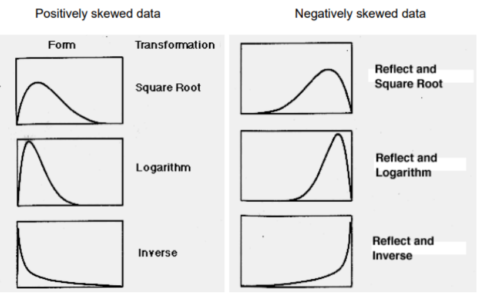

# Data Transformation Techniques

## Normalization

### Min-Max Normalization

$$
V = \frac{[X - min(X)] \times [new.max(X) - new.min(X)]}{max(X) - min(X)} + new.min(X)
$$

```{r}
dataAP3 <- read.csv('./Data/dataAP3.csv', header = T)
head(dataAP3)
```

```{r}
dataAP3 = dataAP3[,-c(1)]
head(dataAP3)
```

We can plot histogram to see whether the data is normal or not.

```{r}
hist(dataAP3$ozone_ppm, main = 'Histogram of Ozone', col = 'aquamarine4', 
     xlab = 'Ozone')
```

now that we've seen that the data is not normal, we can try to normalize it using min-max technique.

```{r}
min_ozone = min(dataAP3$ozone_ppm)
max_ozone = max(dataAP3$ozone_ppm)
v = ((dataAP3$ozone_ppm - min_ozone) * (1 - 0)) / (max_ozone-min_ozone)
head(v)
```

```{r}
hist(v, col = 'bisque3')
```

Try to make it in a function

```{r}
mm = function (x, n.min, n.max) {
  min = min(x)
  max = max(x)
  mm.norm = ((x-min) * (n.max-n.min)/(max-min)) + n.min
  hist(mm.norm, col = 'aquamarine4')
  return(mm.norm)
}

new.dataAP3 = mm(dataAP3$ozone_ppm, 0, 1)
```

### Z-score Normalization

Zero-mean normalization

$$
Z = \frac {X - \mu_x}{\sigma_x}
$$

```{r}
hist(dataAP3$pressure_height.hPA, col = 'skyblue', 
     main = 'Histogram of Pressure Height (hPA)', xlab = 'Pressure Height')
```

```{r}
mean_hpa = mean(dataAP3$pressure_height.hPA)
sd_hpa = sd(dataAP3$pressure_height.hPA)
z_score_hpa = (dataAP3$pressure_height.hPA - mean_hpa) / sd_hpa
head(z_score_hpa)
```

```{r}
hist(z_score_hpa, col = 'bisque3', main = 'Histogram of Normalize Data')
```

Try to make in in a function

```{r}
z = function (x) {
  mean = mean(x)
  sd = sd(x)
  z = (x - mean)/sd
  hist(z, col = 'aquamarine4')
  return(z)
}

z(dataAP3$pressure_height.hPA)
```

### Decimal Scaling

```{r}
pHnew = dataAP3$pressure_height.hPA/1000
head(pHnew)
hist(pHnew, col = 'bisque3')
```

### Normaling Data Distribution



```{r}
dataAP3$Visibility_pAerosol
par(mfrow=c(1,2))
hist(dataAP3$Visibility_pAerosol, col = 'skyblue')
# example of reflecting graph
hist(-dataAP3$Visibility_pAerosol)
```

```{r}
vis2 = sqrt(dataAP3$Visibility_pAerosol)
hist(vis2, col = 'bisque3')
```

## Assessing Normality

### Histogram & Boxplot

```{r}
par(mfrow=c(1,2))
hist(vis2, col = 'bisque3')
boxplot(vis2, col = 'bisque3')
```

### Normal Quantile Plot (Q-Q Plot)

```{r}
qqnorm(vis2, col = 'bisque4')
```

### Goodnes-of-fit test

#### Kolmogorov-Smirnov

$$
H_0 = \text{The sample data follows a normal distribution} \newline
H_1 = \text{The sample data does not follow a normal distribution}
$$

```{r}
ks.test(vis2, 'pnorm', mean = mean(vis2), sd = sd(vis2))
```

#### Shapiro-Wilk

$$
H_0 = \text{The sample data is drawn from a normal distribution} \newline
H_1 = \text{The sample data is not normally distribution}
$$

```{r}
shapiro.test(vis2)
```

#### Anderson-Darling

$$
H_0 = \text{The sample data follows a normal distribution} \newline
H_1 = \text{The sample data does not follow a normal distribution}
$$

```{r}
library(nortest)
ad.test(vis2)
```

## Discretization

### Unsupervised Learning

This method need the knowledge of the industry and can be made manually for example like the financial class (B40, M40, T20)

#### 2 category

```{r}
library(infotheo)
data("USArrests")
attach(USArrests)
USArrests
```

```{r}
cutoff = 10 # Need domain explanation
status_m = ifelse(Murder<10,'Low Risk','High Risk')
head(status_m)

# alternative way
cut(USArrests$Murder, 
     breaks = c(min(USArrests$Murder), 10, max(USArrests$Murder)),
     labels = c('Low Risk', 'High Risk'))
```

#### More than 2 category

```{r}
library(car)
status_den = Recode(UrbanPop, "0:50 = 'Low Density';
                               51:70 = 'Moderate Density';
                               else = 'High Density'")
head(status_den)

# alternative way
```

#### Equal-width

```{r}
assault_status = discretize(Assault, 'equalwidth', 4)
unique(assault_status)
head(assault_status)
```

```{r}
barplot(table(assault_status$X))
hist(assault_status$X)
```

#### Equal Frequency

```{r, fig.align='center'}
barplot(table(discretize(Assault, 'equalfreq', 4)$X), main = 'Equal Frequency')
```

### Supervised Learning

#### Chi2

```{r}
library(discretization)
data(iris)
iris2 = chi2(iris, alp=0.05)$Disc.data
head(iris2)
```

#### ChiMerge Algorithm

#### Top-down algorithm

#### Minimum Description Length Principle (MDLP)

Add : kmeans

```{r}
datalocal = read.csv('./Data/dataLocal.csv', sep = ';')
head(datalocal)
```

```{r}
par(mfrow=c(1,2))
hist(datalocal[,1], col = 'bisque3')
hist(datalocal[,2], col = 'bisque3')
```

```{r}
model = kmeans(datalocal[,1], 3)
km = as.factor(model$cluster)
hist(model$cluster, col = km)
```

## Attribute formation

-   Linear transformation

-   Encoding

    -   One-hot encoding

    -   Ordinal encoding

    -   Target encoding

    -   Frequency encoding

-   Rank transformation

-   Box-cox transformation

-   Polynomial approximation transformation

-   Non-polynomial approximation transformation

-   Wavelet transformation

## Smoothing
