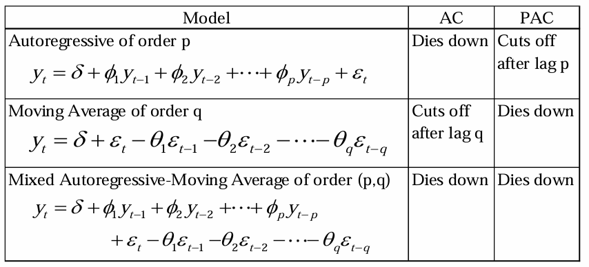

4 main topics in time series

-   Decompose

-   Forecast

-   Clustering

-   Classification

## 1. Convert any data type into "Date" data type ISO 8601

1.  %Y = 4 digit year (2000)
2.  %y = 2 digit year (00)
3.  %m = 2 digit month (12)
4.  %B = month (December)
5.  %b = abbreviated month (Dec)
6.  %d = 2 digit day (03)
7.  %A = day (Sunday)
8.  %a = abbreviated day (Sun)

```{r}
Sys.Date()
```

```{r}
sample_data <- rnorm(60)
ts(sample_data, start=c(2020,2), frequency = 12)
```

```{r}
dates_format <- read.csv('./Data/dates_formats3.csv', sep = ';')
head(dates_format)
```

```{r}
attach(dates_format)
class(Japanese_format)
dates_format$Japanese_format <- as.Date(Japanese_format, format = "%d/%m/%Y")
dates_format
```

## 2. Time Series Decomposition

Time series can be decomposed into 4 components (TSCR) Trend, Seasonal, Cyclical, Random

-   Trend : Increasing and decreasing trend in a data (e.g., linear, polynomial, exponential)

-   Seasonal : seasonal variation that occurs periodically (e.g., hourly, weekly, monthly, quarterly)

-   Cycle : sequence of repeatable event over long period of time, does not occur at equally spaced time intervals and length could change from cycle to cycle

-   Irregular : Remainder between the series and structural component (TSC)

### 2.1 Additive Decomposition

amplitude of the seasonal component roughly remain the same over time.

Y~t~ = T~t~ + S~t~ + C~t~ + I~t~

```{r}
library(USgas)
data(package = 'USgas')
data(usgas)
ts.plot(usgas)
```

### 2.2 Multiplicative Decomposition

Amplitude of the seasonal component increase over time.

Y~t~ = T~t~ x S~t~ x C~t~ x I~t~

## Basic ARIMA model

-   AR : y depends on the past p values of observation

-   MA : y depends on the past q residual values

```{r}
towel <- read.csv('./Data/towel.csv')
head(towel)
```

```{r}
# convert into time series data
towel.ts = ts(towel)
plot.ts(towel.ts)
```

```{r}
# do differencing to achieve stationary
towel.dif = diff(towel.ts)
plot.ts(towel.dif)
```



```{r}
par(mfrow=c(1,2))
acf(towel.ts)
pacf(towel.ts)
```

## Diagnostic

-   Residuals should not be auto-correlated

-   Residuals is distributed approximately normally

-   The variance of the residuals is constant over time.

```{r, fig.height=10}
library(forecast)
tsdiag(auto.arima(towel.ts))
```

Interpretation :

-   **Standardized residuals** : no pattern suggest homoscedasticity

-   **ACF of residuals** : Residuals are not correlated.

-   **p-value for Ljung-Box statistic** : p-value are all above significant line indicates this model

```{r}
hist(residuals(auto.arima(towel.ts)), main = 'Histogram of Residuals',
     col = 'aquamarine4', xlab = 'Residuals')
```

## 2. Time Series Forecasting

```{r}
towel <- read.csv('./Data/towel.csv')
head(towel)
```

```{r}
head(ts(towel))
```

```{r}
library(forecast)
ts.plot(ts(towel), main = 'Towel Daily Sales', xlab = 'Day', ylab = 'Towel')
lines(fitted(auto.arima(ts(towel))), col = 'red', lty = 2)
legend('bottomleft', 'Towel', col = 2, lty = 2)
```

We can see that the data is not stationary (pegun). How to determine whether a data is stationary or not?

A stationary data satisfy these conditions:

1.  Mean is constant over time
2.  Variance is constant over time

Then, what should we do if the data is not stationary, we can do differencing (pembezaan) on the data manually or can do it automatically

```{r}
auto.arima(ts(towel))
```

after we find the ARIMA model,

```{r}
model <- arima(ts(towel), order = c(0,1,1))
summary(model)
```

```{r}
f1 <- forecast(model)
f1
```

```{r}
f2 <- forecast(auto.arima(ts(towel)))
f2
```

```{r}
predict(auto.arima(ts(towel)), n.ahead = 10)
```

```{r}
str(f1)
f1$lower[,1]
identical(f1, f2)
```

## 3. Time Series Clustering

```{r}
load('./Data/sample2.RData')
str(sample2)
```

```{r, warning=FALSE, message=FALSE}
library(dtw)
dist(sample2, method = 'DTW')
```

```{r}
hclust(dist(sample2, method = 'DTW'), method = 'average')
```

```{r}
plot(hclust(dist(sample2, method = 'DTW'), method = 'average'))

```

## 4. Time Series Classification

## Exercise

1.  Import economic_data.csv ke dalam R.
2.  Takrifkan data kepada format siri masa iaitu ianya adalah data bulanan bermula Januari 2000.
3.  Plotkan siri masa tersebut.
4.  Kenalpasti dan suaikan model ARIMA yang sesuai terhadap data.
5.  Jalan peramalan terhadap data untuk 24 bulan seterusnya.
6.  Plotkan peramalan bersama selang keyakinan.

### Read data (economic_data)

```{r}
eco_data <- read.csv('./Data/economic_data.csv', sep = ';')
head(eco_data)
```

```{r}
eco_ts <- ts(eco_data[,2], start = c(2000,1), frequency = 12)
head(eco_ts)
```

```{r}
plot.ts(eco_ts, main = 'Choii', xlab = 'Time', ylab = 'Economy')
```

```{r}
eco_model <- auto.arima(eco_ts)
summary(eco_model)
```

```{r}
fcst <- forecast(eco_model)
fcst
is.null(eco_model)
```

```{r}
#eco_U <- fcst$pred+0.69*fcst$se
#eco_L <- fcst$pred-0.69*fcst$se

```

```{r}
#plot(eco_ts, fcst$mean)
```
