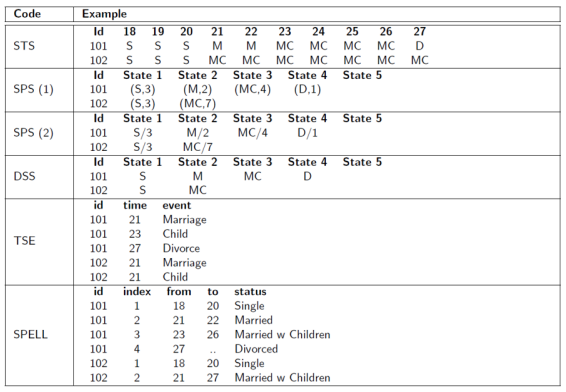
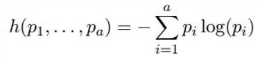

Categorical sequence data analysis. This type of data refers to observation of a particular individuals or entities over some period of time.

Objective :

-   Analyze the behavior of sequence of states for a particular individuals or entities.

    -   What are the characteristics of a sequence data?

    -   What are the indicators that can be used to measure sequence data?

    -   What are the appropriate plots to visualize a sequence data?

    -   How can we compare the similarity between several sequence data?

Example :

-   DNA sequence

-   Life trajectory (occupation history, patient level history, cohabitation life course)

-   Domain (biology, QC, text data, log-web data)

Sequential analysis technique

-   Statistical summary indicators

    -   Mean time spend in each state

    -   Mean time spent in each state by groups

    -   Number of transitions

    -   Transition rates

    -   Time varying transition states

-   Visualization

    -   Sequence index plot

    -   Sequence frequency plot

    -   State distribution plot

    -   Modal state plot

-   Grouping

-   Comparing sequences.

Types of sequence data :

-   State-Sequence (STS)

-   State-Permanence-Sequence (SPS) format

-   Time-Stamped-Event (TSE) format

-   SPELL format

Sequence characteristics by Entropy

-   Visualization

    -   Transversal Entropies

-   Event sequence

-   Categorizing patterns

    -   State distribution

    -   Sequence frequencies

    -   Modal state

    -   Discriminating transitions

-   Sequence analysis

    -   Other approaches

        -   Correspondence analysis of the states

        -   Markov modeling

        -   Event sequence analysis

        -   Survival analysis

        -   Longitudinal analysis

        -   Discrete panel data analysis

Case Study

-   



## ETL

```{r}
library(TraMineR)
data("mvad")
class(mvad)
```

```{r}
class(mvad)
```

## EDA

```{r}
str(mvad)
```

Column 1 - 14 is demography information and not sequence data

Sequence data is column 15 - 86

### Convert data into sequence format

Define label and code for each state

```{r}
unique(mvad$Jul.93)
mvad.labels=c('bekerja', 'sambung belajar', 'pengjian tinggi', 'penganggur',
              'sekolah', 'latihan')
mvad.scode = c('EM', 'FE', 'HE', 'JL', 'SC', 'TR')
mvad.seq = seqdef(mvad, 15:86, states=mvad.scode, labels = mvad.labels, xstep = 6)
# xstep = 6 : 
mvad.seq
```

```{r}
# mean time spent on a state
seqmeant(mvad.seq)
```

### Plot jujukan kekerapan

20 jujukan yang paling kerap berlaku

```{r, fig.height=7, fig.width=7}
seqfplot(mvad.seq, idxs=1:10)
```

### Plot taburan keadaan

```{r, fig.height=7, fig.width=7}
# sequence density plot
seqdplot(mvad.seq, border=NA, main='Plot taburan keadaan')
```

Plot ini memaparkan keadaan dalam rentas masa

```{r, fig.width=7, fig.height=7}
# mode of sequence based on certain time period
# sequence modal state plot
seqmsplot(mvad.seq)
```

### Entropi



#### Transversal Entropy

```{r}
# rate of change
seqHtplot(mvad.seq, main='entropi rentas lintang')
```

```{r}
# mean time spent on a certain sequence
mvad.seqe = seqecreate(mvad.seq)
```

### sub jujukan

```{r}
fsubseq = seqefsub(mvad.seqe, pmin.support=0.05)
```

15 sub jujukan paling kerap berlaku

```{r}
plot(fsubseq[1:15], col='yellow')
```

Clustering

```{r}
library(cluster)
# sequence substituation cost matrix
submat = seqsubm(mvad.seq, method='TRATE')
# sequence distance computation
dist.om = seqdist(mvad.seq, method='OM', sm=submat)
```

dapatkan kelompok dalam data

```{r}
clusterward = agnes(dist.om, diss='T', method='ward')
plot(clusterward); abline(h=800)
```

misalkan k=4 kelompok adalah signifikan

```{r}
cl.4 = cutree(clusterward, k=4)
cl.4fac = factor(cl.4, labels=paste('Kumpulan', 1:4))
head(cl.4fac)
```

Jalankan analisis lanjutan terhadap setiap group.

Setiap individu dalam kumpulan yang sama akan mempunyai ciri yang hampir sama.

Plot kekerapan jujukan, 10 jujukan yang paling kerap berlaku.

```{r}
seqfplot(mvad.seq, group=cl.4fac, main='10 Jujukan yang paling kerap berlaku',
         idxs=1:10)
```

Plot taburan keadaan

```{r}
seqdplot(mvad.seq, group=cl.4fac, border=NA, main='Plot taburan keadaan')
```

Plot rentas lintang

```{r}
seqHtplot(mvad.seq, group=cl.4fac, main='Transversal Entropy')
```

Sub jujukan

```{r}
disc = seqecmpgroup(fsubseq, group=cl.4fac)
plot(disc[1:6])
```
