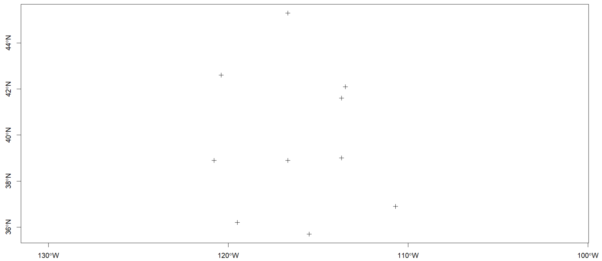

Raster = data gambar

```{r}
# load library
library(sp)
library(raster)
```

```{r}
# load data
load("./Data/wst.RData")
head(wst)
```

```{r}
class(wst)
```

Define spatial data

```{r}
lonlat1 = cbind(wst$longitude, wst$latitude)
pts = SpatialPoints(lonlat1)
pts
```

Define Coordinate Reference System (CRS) in spatial data

```{r}
# define crs
crdref = CRS('+proj=longlat +datum=WGS84')
pts = SpatialPoints(lonlat1, proj4string = crdref)
pts
```

Insert variable information of interest

```{r}
df = data.frame(ID=wst$name, precip = wst$precip)
ptsdf = SpatialPointsDataFrame(pts, data = df)
plot(ptsdf, axes = T)
```

For clearer view :



```{r}
# look at the details of the data
showDefault(ptsdf)
```

```{r}
# spatial lines
lon = c(-116.8, -114.2, -112.9, -111.9, -114.2, -115.4, -117.7)
lat = c(41.3, 42.9, 42.4, 39.8, 37.6, 38.3, 37.6)
lonlat = cbind(lon, lat)
lns = spLines(lonlat, crs=crdref)
plot(lns, axes = T)
```

# Polygon

```{r}
pols = spPolygons(lonlat, crs=crdref)
plot(pols, axes = T)
```

# Raster

```{r}
r = raster(ncol = 20, nrow=20, xmx=-80, xmn=-150, ymn=20, ymx=60)

x = rexp(ncell(r))

values(r) = x

showDefault(r)
```

```{r}
plot(r)
```

```{r}
r2 = r*r
r3 = sqrt(r)
r4 = 2 * r2 + r3
s = stack(r, r2, r3, r4)
showDefault(s)
plot(s)
```

## Present data in data frame

```{r}
library(terra)
f = system.file('external/lux.shp', package='raster')
p = shapefile(f) #spatial polygon
plot(p, axes=T)
```

```{r}
d = data.frame(p)

d
```

```{r}
showDefault(p) # spatial polygons data frame
```

## Extract attribute

```{r}
p$NAME_2
p$AREA
p2 = p[,'NAME_2']
data.frame(p2)
```

## Add new attribute

```{r}
temp = 10 * rexp(12)
p$Temperature = temp
data.frame(p)
```

```{r}
i = which(p$NAME_1 == 'Luxembourg')
g = p[i,]
plot(g, axes = T)
```

## Data integration

```{r}
dfr = data.frame(District=p$NAME_1, Canton = p$NAME_2,
                 Precip = round(100*rexp(12),3)) # simulation data

dfr[order(dfr$Canton), ]

data2 = merge(p, dfr, by.x = c('NAME_1', 'NAME_2'), by.y = c('District', 'Canton'))

data.frame(data2)
```

## Map manipulation

```{r}
z = raster(p, nrow=2, ncol=2, vals=1:4)
names(z) = 'Zone'

z = as(z, 'SpatialPolygonsDataFrame')

plot(p, axes=T)
plot(z, add = T, border = 'blue', lwd = 4)
```

Buang zone tertentu

```{r}
z2 = z[2, ]
plot(p, axes=T)
plot(z2, add = T, border = 'red')
```

```{r}
e = erase(p, z2)
plot(e,axes = T)
```

```{r}
e = intersect(p, z2)
plot(e,axes = T)
```

```{r}
e3 = extent(6,6.8,49.7,50)
pe = crop(p, e3)
plot(p, axes=T)
plot(pe, axes = T, col= 'green', add = T)
```

# Data manipulation for spatial raster

## Extracts a single RasterLayer object from a RasterBrick or RasterStack object.

```{r}
plot(s)
```

## 

```{r}
r5 = raster(s, layer = 2)
plot(r5)
```

## Algebra in raster data

```{r}
r6 = r2 + 10
r7 = r6 ^ 2
r8 = r * r2 + r7
plot(r8)
```

## Add new values in the cell.

```{r}
pi = rgamma(400,30,20)
r8$new = pi
plot(r8)
```

## Crop and merge raster data

```{r}
l2 = crop(s, extent(-130, -90, 30,40))
plot(l2)
```

```{r}
l3 = crop(s, extent(-100, -80, 40, 50))
m = merge(l2, l3)
plot(m)
```

## Descriptive functions.

mean

```{r}
cellStats(s, mean)
```

standard deviation

```{r}
cellStats(s, sd)
```

can try for other statistical measure such as median, range and so on

# Spatial Autocorrelation (Moran-i Statistics)

```{r}
p = shapefile(system.file('external/lux.shp', package='raster'))
library(spdep)
w = poly2nb(p)
ww = nb2listw(w)
moran.test(p$AREA, ww)
```

Interpretation :

-   p-value 0.8248

Spatial interpolation

```{r}
library(devtools)
#install_github('rspatial/rspat')
library(rspat)
```

```{r}
#precipitation in California
d = spat_data('precipitation')
```

```{r}
d$prec = rowSums(d[, 6:17])
dsp = vect(d, c('LONG', 'LAT'), crs = '+proj=longlat +datum=WSG84')
CA = spat_data('counties')
```

```{r}
cuts = c(0, 200, 300, 500, 1000, 3000)
library(ggplot2)
blues = colorRampPalette(c('yellow', 'orange', 'purple', 'blue',
                           'darkblue'))
plot(CA)
plot(dsp, 'prec', type = 'interval', col=blues(10), breaks=cuts, add=T)
```

```{r}
v = voronoi(dsp)
plot(v)
```

```{r}
vca = crop(v, CA)
plot(vca, 'prec')
```

```{r}
houses = read.csv('./Data/hd.csv')
str(houses)
```

Transform data into spatial

```{r}
hvect = vect(houses, c('longitude', 'latitude'))
plot(hvect, cex=0.5, axes=T)
```

```{r}
countries = spat_data('counties')
crs(hvect) = crs(countries)

# normal regression
hd = houses
model = glm(houseValue~income+houseAge+roomhead+bedroomhead+population, 
            data = hd)
summary(model)
```

```{r}
# geographically weighted regression (GWR) 
plot(hvect, cex = 0.5, axes = T)
plot(countries, add = T)
```

```{r}
countrynames = unique(hd$NAME)

# Regression model towards difference places
regfun = function (x) {
  dat = hd[hd$NAME == x, ]
  m = glm(houseValue~income+houseAge+roomhead+bedroomhead+population, 
          data = dat)
  coefficients(m)
}

hd2 = hd[!is.na(hd$NAME ), ]
countrynames = unique(hd2$NAME)
res = sapply(countrynames, regfun)

# effect of income toward house value
dotchart(sort(res['income', ]), cex = 0.5)
```

```{r}
# create map for variance parameter local regression
resdf = data.frame(NAME=colnames(res), t(res))
dcounties = aggregate(countries[, 'NAME'], 'NAME')
cnres = merge(dcounties, resdf, by = 'NAME')

# influence of income toward house value according to different locations
plot(cnres, 'income')
```

```{r}
# for other variables
cnres2 = cnres
values(cnres2) = as.data.frame(scale(as.data.frame(cnres)[-1]))
plot(cnres2, 2:7, plt=list(x='topright'), mar=c(1,1,1,1))
```
