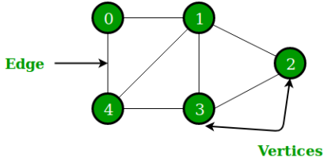
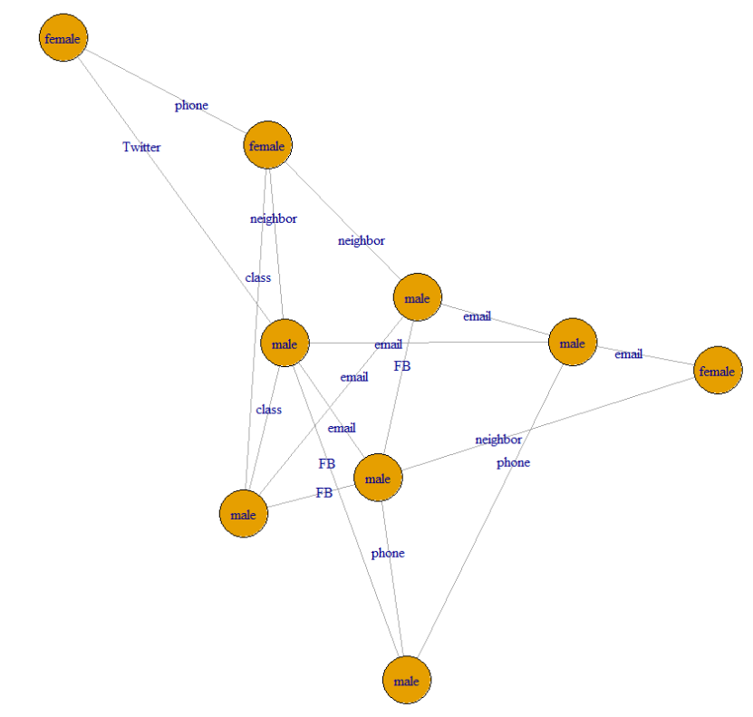

Graph Data

-   Non-linear data structure that consist of nodes and edges

Objective

-   Extract meaningful insight from graph data

-   Explain the links, relationships, or interconnections among some entities

Example

-   Social network

-   web

-   cyber security

-   power grid

-   supply chain

-   protein-protein interaction

Graph theory

-   Mathematical foundation used to model pairwise relation between objects

-   A structure data that contain vertices (nodes) and egde



Basic terms

-   Graph

-   Edge

-   Degree

-   Loop

-   Multiple edge

-   Simple graph

-   Sub-graph

-   Clique

-   Path and circle

-   Isomorphic

    -   2 graphs are isomorphic if they have different forms but have the same number of vertexes, edges, and the same relationship

-   Automorphic

    -   2 graphs are automorphic if they have same structure but different relationship behaviour

Types of graphs

-   Directed and undirected graph

-   Weighted and unweighted graph

-   Labeled and unlabeled

-   cyclic and acyclic

-   Trees Graph

-   Bipartite graph

-   Hypergraph

Representations for graph

-   Adjacency list

-   Edge list

-   Adjacency matrix

Graph manipulation

-   Remove nodes(vertices)

-   Generate subgraph

-   Join graphs

-   Modify nodes data

-   Modify edge data

Link and Network analysis

-   Link : relationship between two entities

-   Network : collection of entities and links between them

Node prominence analysis

-   Degree centrality

-   Closeness centrality

-   Betweenness centrality

-   Eigenvector centrality scores

-   Information centrality scores

-   Flow betweenness scores

-   Centralization

-   Cutpoints

Subgroup analysis

-   Types of cohesive subgroups

    -   Clique

    -   k-Cores

-   Technique to investigate a subgroup structure based on community detection

    -   Modularity

    -   Community detection

# Data Jaringan (Network Science)

```{r, warning=FALSE}
# Perlombongan data graf
library(igraph)
```

# Types of graph

## 1) Undirected graph

```{r}
g = graph_from_literal(1-2, 1-3, 1-7, 3-4, 2-3, 2-4, 3-5, 4-5, 
                       4-6, 4-7, 5-6, 5-8, 6-7, 7-8)
g
class(g)
```

```{r}
# labelkan nod/verteks
V(g)$name = c('Adam', 'Judy', 'Bobby', 'Sam', 'Frank', 'Tom', 'Jerry', 
              'Jay')
g
```

```{r}
# Plot graf dengan hubungan tak terarah
set.seed(12)
plot(g)
```

## 2) Directed Graph

```{r}
dg = graph_from_literal(KL-+CHINA, KL-+London, CHINA++London)
dg
```

```{r}
plot(dg)
```

## 3) Weighted Graph

-   berapa kuat hubungan antara nod/verteks

```{r}
m = read.table(row.names=1, header=T, 
               text=' A   B   C   D   E   F
                    A 0   0   0   0   0   1
                    B 0   0   0.5 0   0   0.5
                    c 0.5 0.2 0   0.3 0   0 
                    D 0.1 0   0   0   0.3 0.6
                    E 0.2 0   0.1 0   0.7 0 
                    F 0   0.4 0.2 0   0.3 0.1')

m = as.matrix(m)

ig = graph_from_adjacency_matrix(m, weighted=T)
plot(ig, edge.label=E(ig)$weight)
```

## 4) Labeled Graph

## 5) Cyclic Graph

At least ada 1 kitaran dah boleh dianggap sebagai graf berkitar

## 6) Acyclic Graph

```{r}
plot(dg)
```

## 7) Trees Graph

```{r}
tr = make_tree(40, children=3, mode='undirected')
plot(tr)
class(tr)
```

## 8) Bipartite Graph

Bipartite graph is a type of graph where vertices can be divided into 2 disjoint set, with each edge connecting a vertex in one set to a vertex in another set. There will be no edge connecting vertices in the same set.

```{r}
# no. bottom vertices, no. top vertices, connection probability
gb = sample_bipartite(10, 5, p=0.4) 
col = c('blue', 'red')
shape = c('circle', 'square')
plot(gb, vertex.color = col[as.numeric(V(gb)$type+1)],
     vertex.shape=shape[as.numeric(V(gb)$type+1)])
class(gb)
```

## 9) Hypergraph

2-hypergraph : 1 edge connects 2 nodes

```{r, warning = FALSE}
library(HyperG)
h = hypergraph_from_edgelist(list(1:2, 2:5, 3:7, c(1,3,5,7,9)))
plot(h)
```

# Representations for Graphs

## 1) Adjacency list

```{r}
plot(g)
```

```{r}
Adj.list1 = as_adj_list(g)
Adj.list1
```

```{r}
Adj.list2 = as_adj_list(dg)
Adj.list2
```

```{r}
Adj.list3 = as_adj_list(tr)
Adj.list3
```

## 2) Edge list

```{r}
Ed.list1 = as.data.frame(as_edgelist(g))
Ed.list1
```

```{r}
Ed.list2 = as.data.frame(as_edgelist(dg))
Ed.list2
```

```{r}
Ed.list3 = as.data.frame(as_edgelist(gb))
Ed.list3
```

## 3) Adjacency Matrix

```{r}
Adj.M1 = as_adjacency_matrix(g)
Adj.M1
```

```{r}
Adj.M2 = as_adjacency_matrix(dg)
Adj.M2
```

# Graph Manipulation

Among the important techniques of graph manipulation are:

1.  remove specific nodes/vertices.

2.  generate subgraph.

3.  join graphs.

4.  modify the nodes data.

5.  modify the edge data.

```{r}
library(igraph)
g = graph_from_literal(1-2, 1-3, 1-7, 3-4, 2-3, 2-4, 3-5, 4-5, 
                       4-6, 4-7, 5-6, 5-8, 6-7, 7-8)
V(g)$name = c('Adam', 'Judy', 'Bobby', 'Sam', 'Frank', 'Tom', 'Jerry', 
              'Jay')
plot(g)
```

## Remove Specific Nodes/Vertices

```{r}
h = g- vertices(c('Jerry', 'Bobby'))
h
```

```{r}
par(mfrow=c(1,2))
plot(g)
plot(h)
```

## Generate Subgraph

```{r}
h2 = graph_from_literal('Adam'-'Judy', 'Adam'-'Tom', 'Judy'-'Aminah', 
                        'Aminah'-'Frank')
plot(h2)
```

## Join Graph

```{r}
h3 = union(h2, g)
plot(h3)
```

## Modify the Nodes Data

```{r modify_nodes_data}
V(h3)
V(h3)$gender = c('male', 'female', 'male', 'female', 'male', 'male', 'male',
                 'male', 'female')
plot(h3)
```

```{r}
vertex_attr(h3)
```

## Modify the Edge Data

```{r}
# view the edge of the graph
E(h3)
```

```{r}
E(h3)$type = c('email', 'phone', 'FB', 'email', 'class', 'Twitter', 'neighbor',
               'phone', 'FB', 'email', 'class', 'neighbor', 'phone', 'email', 
               'email', 'FB', 'neighbor')
```

```{r}
edge_attr(h3)
```

```{r}
E(h3)$weight = c(10,1,3,2,2,2,1,5,9,8,1,6,2,9,3,10,7)
```

```{r}
edge_attr(h3)
```

# Graph Visualization

```{r}
plot(h3, vertex.label=V(h3)$gender, edge.label = E(h3)$type)
```

For clearer view :



```{r}
plot(h3, vertex.label=V(h3)$name, edge.label = E(h3)$weight)
```

# Node Prominence Analysis

```{r, warning = FALSE}
library(statnet)
```

install UserNetR from github

```{r, warning = FALSE}
library(devtools)
install_github('DougLuke/UserNetR')
library(UserNetR)
```

```{r}
data(Bali)
par(mar=c(1,1,1,1))
plot(Bali, displaylabels = T)
```

```{r}
Bali
```

Node names

```{r}
name = Bali%v%'vertex.names'
name
```

Node roles

```{r}
Role = Bali%v%'role'
Role
```

Edge attribute

```{r}
Attr = Bali%e%'IC'
Attr
```

# Prominence Node Measurement:

## Degree Centrality

```{r}
deg = degree(Bali)
deg
```

## Closeness Centrality

```{r}
cls = closeness(Bali)
cls
```

## Betweenness Centrality

```{r}
btw = betweenness(Bali)
btw
```

## Eigenvector Centrality Scores

## Information Centrality Scores

## Flow Betweenness Scores

## Centralization

graph centralization measure

Ukuran pemusatan graph

```{r}
centralization(Bali, degree)
```

```{r}
centralization(Bali, closeness)
```

## Cutpoints

Analisis titik potong

```{r}
net = Bali
cpnet = cutpoints(net, return.indicator = T)
cpnet
name[4]
```

# Subgroups analysis

```{r, fig.height=8, fig.width=8}
data(Facebook)
plot(Facebook)
class(Facebook)
```


## Clique

```{r}
clique = cliques(Facebook)
```

```{r}
# biggest clique
max_clique = max_cliques(Facebook)
```

## k-Cores

```{r}
k_core = coreness(Facebook)

# plot same cores
V(Facebook)$color = as.factor(k_core)
plot(Facebook, main = 'Subgroups based on cores', vertex.size=7, 
     vertex.label.cex=0.7)
```

Community detection & modularity measure

```{r, fig.height=10, fig.width=10}
#community detection
community_d = cluster_louvain(Facebook)
plot(community_d, Facebook)
```

```{r}
#modularity
# measure of how well a graph is divided into clusters (or communities)
modularity_score = modularity(community_d)
modularity_score
```
