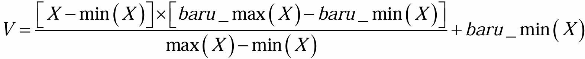
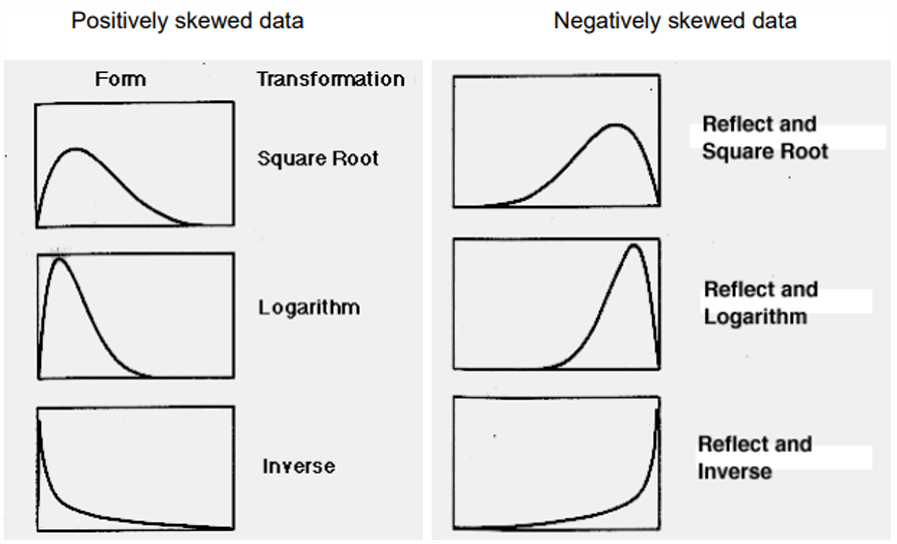

# Data Transformation and Discretization

## Normalization

### Min-Max Normalization

```{r}
dataAP3 <- read.csv('dataAP3.csv', header = T)
head(dataAP3)
```

```{r}
dataAP3 = dataAP3[,-c(1)]
head(dataAP3)
```

```{r}
hist(dataAP3$ozone_ppm)
```



```{r}
min_ozone = min(dataAP3$ozone_ppm)
max_ozone = max(dataAP3$ozone_ppm)
v = ((dataAP3$ozone_ppm - min_ozone) * (1 - 0)) / (max_ozone-min_ozone)
head(v)
```

```{r}
hist(v)
```

### Z-score Normalization

```{r}
mean_hpa = mean(dataAP3$pressure_height.hPA)
sd_hpa = sd(dataAP3$pressure_height.hPA)
z_score_hpa = (dataAP3$pressure_height.hPA - mean_hpa) / sd_hpa
head(z_score_hpa)
```

### Decimal Scaling

```{r}
pHnew = dataAP3$pressure_height.hPA/1000
head(pHnew)
```

### Normaling Data Distribution



```{r}
dataAP3$Visibility_pAerosol
hist(dataAP3$Visibility_pAerosol)
```

```{r}
vis2 = sqrt(dataAP3$Visibility_pAerosol)
hist(vis2)
```

## Assessing Normality

### Histogram & Boxplot

### Normal Quantile Plot (Q-Q Plot)

### Goodnes-of-fit test

#### Kolmogorov-Smirnov

#### Shapiro-Wilk

#### Anderson-Darling

## Discretization

### Unsupervised Learning

This method need the knowledge of the industry and can be made manually for example like the financial class (B40, M40, T20)

```{r}
library(infotheo)
data("USArrests")
attach(USArrests)
head(USArrests)
```

```{r}
cutoff = 10 # Need domain explanation
status_m = ifelse(Murder<10,'Low Risk','High Risk')
head(status_m)
```

## Attribute formation

## Amoothing
